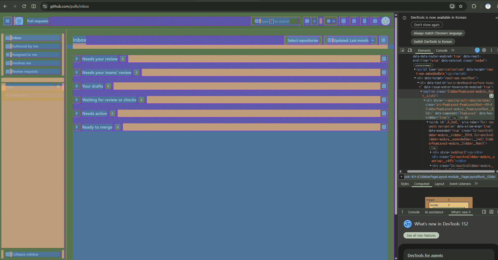

1. 덩어리 구조 파악
2. 기본 틀 잡기 (세분화)
    - head, body
    - header, main, footer
    - div
    - div  class='파트별'

3. 각 버튼과 기능 순서대로 삽입

---
1. div가  너무 많음
 - 시멘틱 사용 가능한 곳은 사용해서 간단하게 틀 잡기
    - header, main, footer
    - div 각 파트 감싸는 용으로 사용.
    - section, aside로 내용 구분하기

2. 폰트 깨짐 이슈
    - font-family 확인 -> 띄어쓰기 있는 폰트 따옴표로 감싸주지 않은게 있었음. -> 그래도 해결x
    - 

* `<a href="javascript:void(0)">` : 눌러도 반응 없게 만들어둠 (현재 레벨 자바스크립트 구현 불가능)